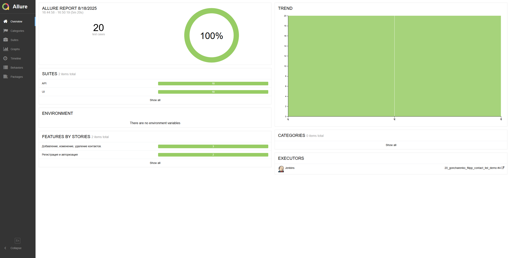
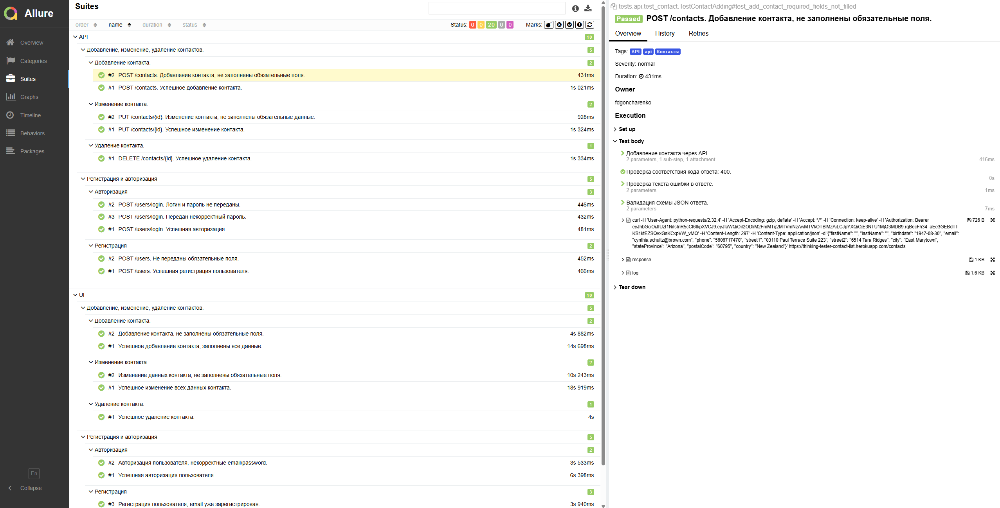
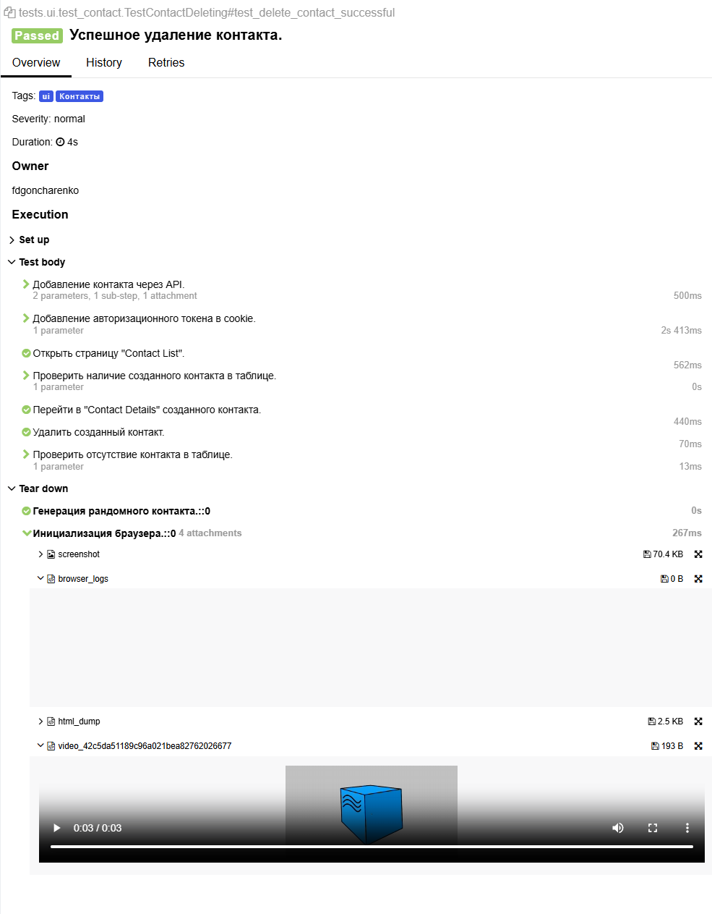
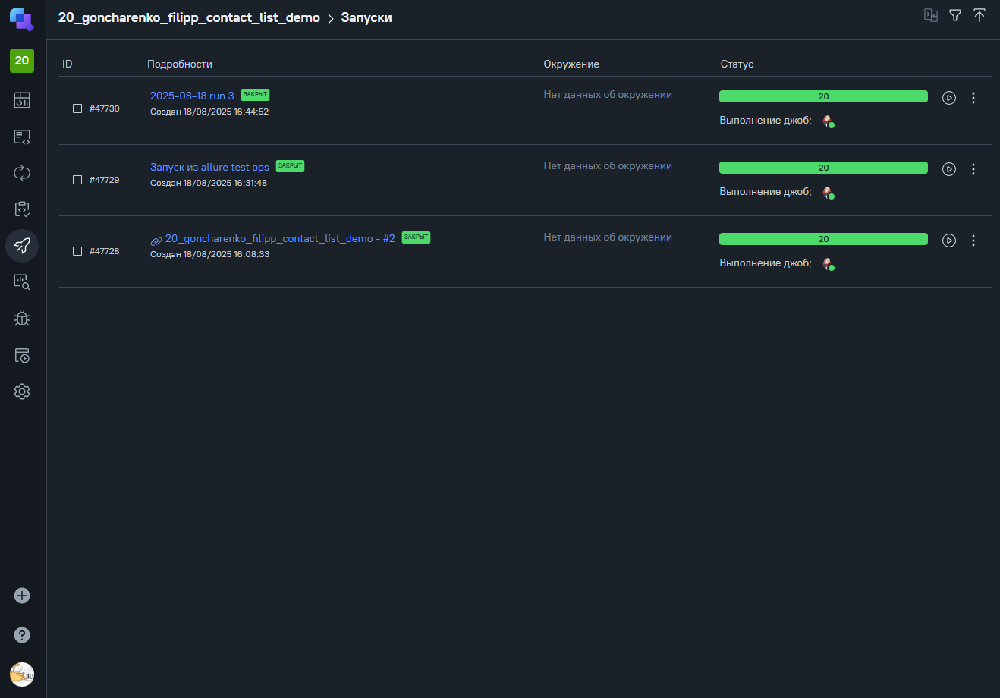
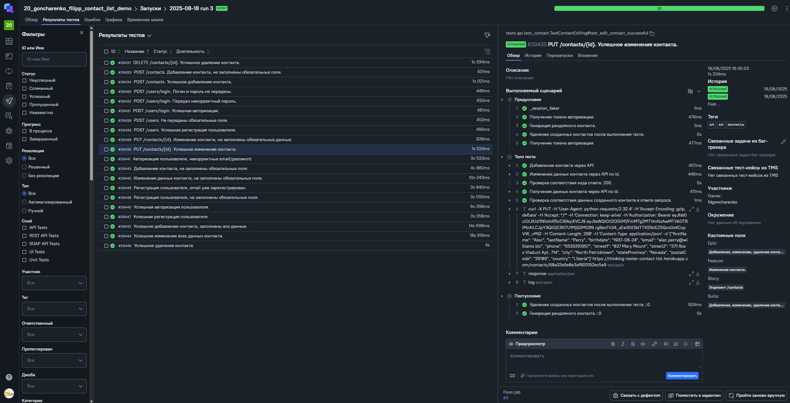
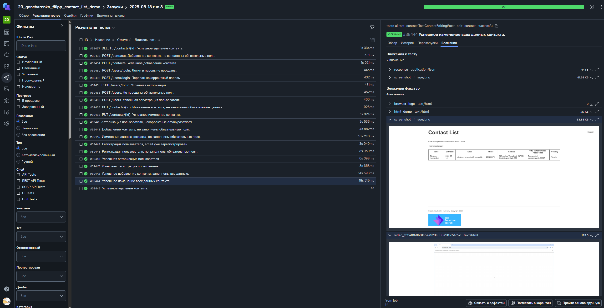
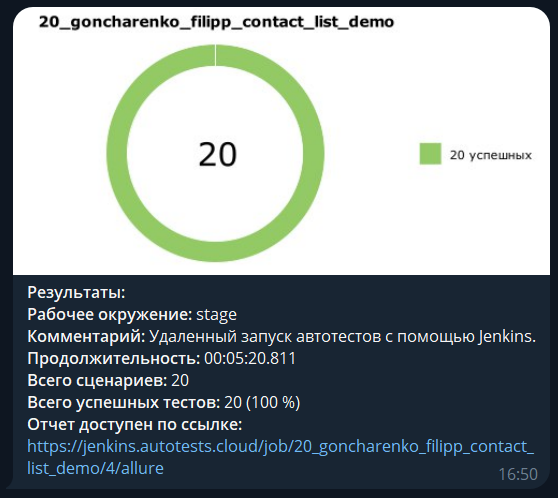
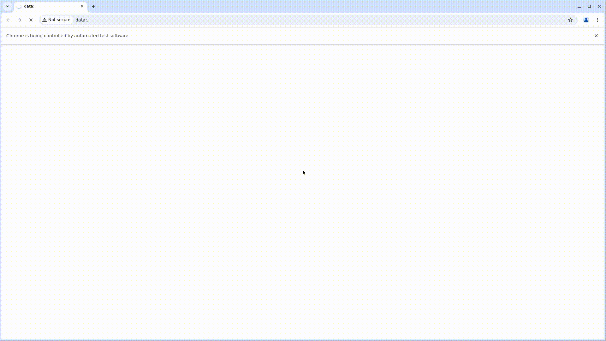

# Демо-проект по автоматизации UI и API уровней приложения Contact List App

> <a target="_blank" href="https://thinking-tester-contact-list.herokuapp.com/">Ссылка на сайт</a>
----
### Проект реализован с использованием:


----

### Особенности проекта

* Отчеты с видео, скриншотом, логами, исходной моделью разметки страницы
* Сборка проекта в Jenkins
* Запуск UI тестов в Selenoid
* Отчеты Allure Report
* Интеграция с Allure TestOps
* Оповещения о тестовых прогонах в Telegram

 ### Список проверок, реализованных в UI и API автотестах

#### Регистрация

- [x] Успешная регистрация пользователя.
- [x] Регистрация пользователя, не заполнены обязательные поля.
- [x] Регистрация пользователя, email уже зарегистрирован.

#### Авторизация

- [x] Успешная авторизация пользователя.
- [x] Авторизация пользователя, некорректные email/password.

#### Добавление контакта

- [x] Успешное добавление контакта, заполнены все данные.
- [x] Добавление контакта, не заполнены обязательные поля.

#### Изменение контакта

- [x] Успешное изменение всех данных контакта.
- [x] Изменение данных контакта, не заполнены обязательные поля.

#### Удаление контакта

- [x] Успешное удаление контакта.

____

### Локальный запуск
> Для локального запуска необходимо выполнить команды:
```
python -m venv .venv
source .venv/bin/activate
pip install -r requirements.txt
pytest .
```
----

### Удаленный запуск автотестов выполняется в Jenkins или в Allure TestOps
> <a href="https://jenkins.autotests.cloud/job/20_goncharenko_filipp_contact_list_demo/">Ссылка на проект в Jenkins</a>

> <a href="https://allure.autotests.cloud/project/4886/dashboards/">Ссылка на проект в Allure TestOps</a>

#### Для запуска автотестов в Jenkins

1. Открыть <a target="_blank" href="https://jenkins.autotests.cloud/job/20_goncharenko_filipp_contact_list_demo/">проект</a>
2. Нажать кнопку `Build Now`
3. Результат запуска сборки можно посмотреть в отчёте Allure, в запуске Allure TestOps

#### Для запуска автотестов в Allure TestOps

1. Открыть <a target="_blank" href="https://allure.autotests.cloud/project/4886/dashboards">проект</a>
2. В боковом меню перейти на вкладку "Джобы".
3. Кликнуть кнопку "Запустить джобу" у `20_goncharenko_filipp_contact_list_demo`
4. В открывшемся модальном окне при необходимости указать название и другую мета-информацию.
5. Кликнуть на кнопку "Отправить".
6. Отслеживать выполнение можно на вкладке<a target="_blank" href="https://allure.autotests.cloud/project/4886/launches">"Запуски"</a>.


----

### Параметры pytest при локальном запуске

<code>pytest .</code> – запуск всех тестов.

<code>pytest -m api</code> – запуск API тестов.

<code>pytest -m ui</code> – запуск UI тестов.


### Allure отчет


#### Общие результаты


#### Список тест кейсов в Allure 


#### Пример тест кейса в Allure с логированием и вложениями


### Allure TestOps

#### Примеры запуска в Allure TestOps

<br>

<br>


#### Нотификация в Telegram


#### Видео прохождения теста Web
